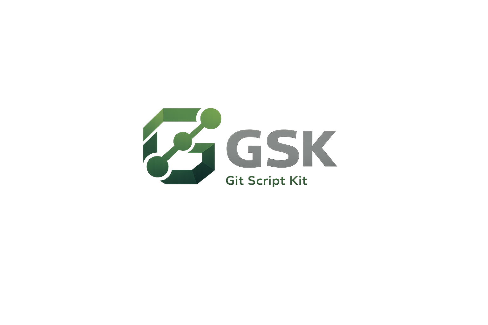

  

  
  
  
  

  

# GSK - Git Script Kit

> ⚠️ This is the **official repository** of the Git Script Kit project.  
> Beware of unofficial copies or modified versions that may contain unsafe files.

## 📌 Overview

The GSK (Git Script Kit) is a Shell Script framework for Git, Software Configuration Management (SCM), and DevOps, developed to automate processes, simplify operations, and strengthen the governance of the software development lifecycle.

It provides a unified CLI that standardizes branching workflows through GSK Flow, encapsulates complex Git operations (such as merge, rebase, and cherry-pick), supports advanced features (Git LFS and submodules), integrates natively with the Azure DevOps API, and enables the automation of CI/CD pipelines in Jenkins and Azure DevOps.

It is built on a modular architecture oriented by the Single Responsibility Principle (SRP), featuring reusable internal scripts that reduce code duplication and simplify maintenance. Each command includes parameter validation, a structured help system, and execution logging geared toward auditing and troubleshooting. It is compatible with Windows, WSL, and Linux, with full support for Bash and Zsh.

## 📊 By the Numbers

| GSK Commands         |      300+ |
| Internal Scripts     |      100+ |
| In Active Development | 15+ years |

## ❓ Why This Project Exists

GSK was created to address real challenges in large-scale development environments, where Git usage varies significantly among teams and operational mistakes can lead to rework, broken pipelines, and inconsistencies.

Before GSK, common issues included:

- Branching inconsistencies.
- Dangerous or repetitive manual Git operations.
- Merge conflicts caused by improper workflows.
- Lack of uniformity between Windows, WSL, and Linux users.
- No integration between Git actions and Azure DevOps.
- Recurring human errors affecting SCM and DevOps processes.

> GSK has evolved continuously since 2011 and remains an essential tool for efficient and consistent delivery.

## 🚀 Key Benefits

### Simplified Git usage
Provides intuitive commands with syntax similar to native Git operations.

### Error prevention
Validation layers, structured logs, informative messages, and automated handling reduce operational mistakes.

### Reuse and maintainability
Each script follows SRP, avoiding duplicated logic and enabling cleaner evolution.

### Corporate integrations
Includes native integration with the **Azure DevOps REST API**, enabling tasks such as:
- branch management
- work item interactions
- group and permission queries
- automated pipeline routines

### Cross-platform compatibility
Works consistently across:
- **Bash** and **Zsh**
- **Windows**
- **WSL**
- **Linux**

### Standardized workflow
Native support for [GSK Flow](docs/assets/gsk-flow.png), a Git workflow model inspired by Git Flow and GitLab Flow, developed exclusively for the framework.

### CI/CD process automation
Scripts can be used in Jenkins or Azure DevOps pipelines, reducing manual work and ensuring process consistency.

## 🔧 Additional Features

- Intelligent auto-complete
- Windows context-menu integration
- Standardized color scheme across all commands

## ⚠ Restrictions and Best Practices

To ensure integrity and compatibility across versions:

- **Do NOT move scripts between directories**
- **Do NOT edit scripts directly**
- **Do NOT rename internal scripts**

> 🔶 _Any manual modification will be automatically discarded during the update process_.

For safe customization:

- Define custom aliases  
- Add external user-defined scripts  

## 👤 Author

**Alex Ferreira de Almeida**  
Software Engineer  

## 🔒 Disclaimer

This repository contains **public documentation only**.  
The actual source code of the GSK is private and cannot be published due to internal processes, proprietary integrations, and corporate security policies.

This README exists solely to document the project’s existence, architecture, design principles, and authorship.

## 📝 License

This project is licensed under the [MIT License](LICENSE).

You are free to use, modify, and distribute this project for personal or commercial purposes, provided that the original authorship and license notice are preserved.

## 📅 Project Status

**Active - 2011 to Present**
